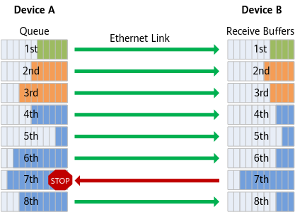

# 高速互联：无损网络介绍
- author by: 焦方正
## 无损网络的必要性

为了实现内核卸载，达到高带宽、低延时的传输目的，RDMA在设计之初便要求将所有网络协议栈卸载到网卡（RNIC）进行，以规避CPU参与传输过程。在应对丢包时的重传策略选择上，传统TCP的缓存并乱序重组的方案对网卡的缓存资源和处理能力要求极高。同时，RDMA设计之初是基于IB网络，其采用的逐跳的，信用的控制方式很难产生丢包，因此在重传策略上，选择了简单高效的go-back-N的方式，即默认网络不会产生丢包，一旦接收乱序，便进行丢弃重传。

在RoCE网络中，通常使用RoCEv2来实现大规模的互联互通。RoCEv2采用UDP的无连接不可靠传输协议，不像TCP协议这样的可靠传输机制，具有滑动窗口、确认应答的机制。而RDMA的重传策略又采用go-back-N的方式，因此在以太网络上丢包对RDMA的传输性能影响极大。

在不考虑链路误码这种非正常情况，数据传输过程中所有交换设备理论上都可以按照设计的线速转发传输数据包。但是一旦数据传输出现争抢，如两条链路的流量需要一个端口进行转发，数据包就会在该入端口的缓存进行排队。我们把这种现象称作incast。每个端口的缓存Buffer大小有限，一旦超过这个端口的缓存能力，端口会将无法缓存下来数据包丢弃，从而产生丢包。如前文说所，RDMA对丢包十分敏感，因此为了防止丢包产生，交换机需要预先采取相应的措施来避免这种情况发生。因此，便推出基于优先级的流量控制（Priority Flow Control，PFC）机制来实现无损网络。

## PFC协议

PFC是IEEE 802.1Qbb标准定义的链路级流量控制协议，核心目标是为不同优先级流量提供独立的无损通道。PFC是点对点的流量控制协议，整个过程通过Xon和Xoff参数进行控制。当接收端交换机/网卡检测到某优先级队列的缓冲区大小积累的数据包量超过Xoff时，便会立刻向上游发送PFC暂停帧​（Pause Frame）。上游设备收到后，立刻停止​该优先级流量的发送​，其他优先级流量不受影响。随着上游停止发送，下游持续转发，入口缓冲区大小逐渐下降，当达到Xon大小时，会向上游端口发送恢复帧(Resume Frame)

通过PFC的机制可以总结出PFC协议具有以下几个特点：
- 点对点控制协议，链路两端通过相关的控制帧，实现流量发送的启停。
- 流量控制过程是粗暴地、无脑地。只存在发和不发两个状态，一旦Xon发送不及时，容易降低带宽利用率。
- 控制时延是一跳，Xoff参数剩余的空间必须能够存储一个带宽时延积的数据包大小才能保证Pause生效前，吸收链路上flight的数据包。
- 只按照队列进行区分，并不能区分流量，因此在多流环境下，进入同一端口的流量都会受到影响。

## PFC协议存在的问题
如上所说的PFC特点，在实际环境中，PFC还存在一下四个主要问题：
- 队头阻塞(Head-of-Line Blocking)。PFC的控制粒度是按照是优先级队列。一个优先级队列中通常存在​​多个不同的数据流​​。当该队列因其中一个流出现拥塞，如ABC三条流，其中C流去往的端口产生拥塞导致队列累积，当触发PFC机制时，上游该优先级通道都会被暂停。这意味着，​该队列中所有无关的数据流都会被阻塞​​，即使它们(AB)的目的地端口空闲且没有任何拥塞。如下图所示。

- 不公平。当Pause帧产生，同时向C端口发送的AB两个端口入端口的上游同时停止，当Resume帧发出，AB两个端口又同时开始发送数据。如果A端口只接收一个流，而B端口有两个流，由于同时开始这个过程,B中的两条流同时与A中的一个流竞争，导致A的流量占据一半带宽。如下图所示。

- PFC风暴。由于PFC策略是点到点的控制，并不能直接降低源头的发送速率，所以当前方出现拥塞而发送方还在持续发送时，PFC会逐级反压，甚至直接传导到发送方。该过程会产生大量的Pause帧，从而使链路发送停滞，由于队头阻塞的影响，收到影响的链路范围也越来越广，从而产生风暴。

- PFC死锁。当PFC产生逐级反压时，一旦网络中存在环路（配置错误，路由收敛时的瞬时环路，设备故障等），PFC将会形成环形暂停从而造成死锁，所有端口都无法发送数据，队列挤压，同时向上游端口发送暂停。这种相互等待一旦发生。没有外力干预几乎不可能自己恢复。

